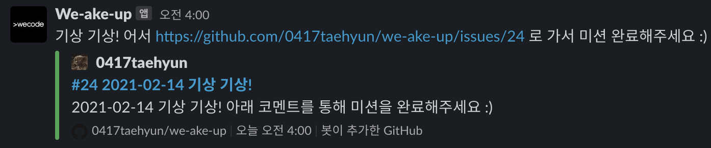
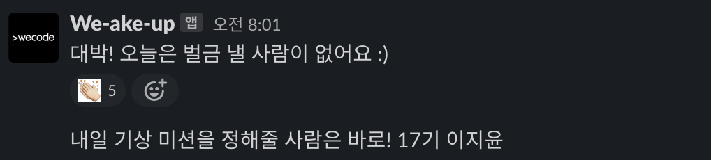

## [ We Code ] #we-ake-up Slack 채널 기상 확인 레포지토리

### Introduction
> 해당 레포지토리에는 We Code 부트캠프 사람들의 기상 스터디인 'we-ake-up'의 효율적인 진행을 위해 AWS Lambda, AWS CloudWatch Events, Slack API, GitHub API를 활용한 Python 소스 코드가 있습니다. 아래 사진과 같이 스케줄링을 통해서 특정 시간에 동작합니다.

### How to work
> 아래 글을 통해서 동작 원리에 대한 자세한 설명을 확인할 수 있습니다.
1. [AWS Lambda에 관한 기본 개념](https://bit.ly/2Z7CciN)
2. [GitHub API 사용 방법](https://bit.ly/3rZCBQR)
3. [AWS Lambda & CloudWatch Events, Slack API, GitHub API를 통한 실제 구현 ](https://bit.ly/3qnOoYB)

### config
> 개인 정보가 작성된 파일입니다.
1. `config.py` : 실제 AWS Lambda를 작동할 때 필요한 정보가 들어 있는 파일입니다. 개인 정보가 담긴 파일로 `.gitignore` 를 통해 본 레포지토리에는 업로드 되어 있지 않습니다.
2. `config_example.py` : `config.py` 파일에서 실제 정보를 제거하여 올린 파일입니다. 동작 원리를 참고할 수 있게 만들어 첨부하였습니다.

### main
> AWS Lambda를 동작시키는 함수가 작성된 파일입니다.
1. `lambda_handler()` : 실제 AWS  Lambda에서 동작하는 함수로 `Worker` 클래스의 `create_issue` 와 `close_issue` 함수를 사용하여 GitHub Issue를 생성 및 닫고 Slack에 보여줍니다.

### worker
> GitHub API와 Slack API를 사용하는 함수가 작성된 파일입니다.
1. `create_time()` : GitHub Issue를 작성할 때와 Slack에 메세지를 보낼 때 오늘의 날짜를 생성해 사용할 함수입니다. 이때 `timedelta` 를 통해 UTC 기준이었던 시간을 한국으로 바꾸고 `strftime` 을 통해 `datetime` 객체를 문자열로 바꿉니다.
2. `Worker()` : GitHub API와 Slack API가 동작하는 클래스 입니다.
    1. `__init__()` : 매개변수로 `url` , `headers` 를 받아 함수에서 계속 사용합니다.
    2. `get_issues()` : 이후 `close_issue()` 함수에서 Issue number가 필요하기 때문에 이를 얻기 위해 사용합니다.
    3. `create_issue()` : GitHub 레포지토리에 실제 Issue를 생성하고 `Slacker` 를 활용하여 Slack 채널에 해당 Issue URL 등의 정보를 메세지로 전송합니다.
    4. `close_issue()` : 생성 되었던 Issue를 닫고 Comment를 달았던 사람들을 확인하여 전체 목록에서 실패한 사람을 추출, Slack 채널에 해당 정보를 메세지로 전송합니다.

### library
> `requirements.txt` 또는 `python.zip` 을 통해서도 필요 라이브러리 및 패키지를 확인할 수 있습니다.
1. `pip install slacker`